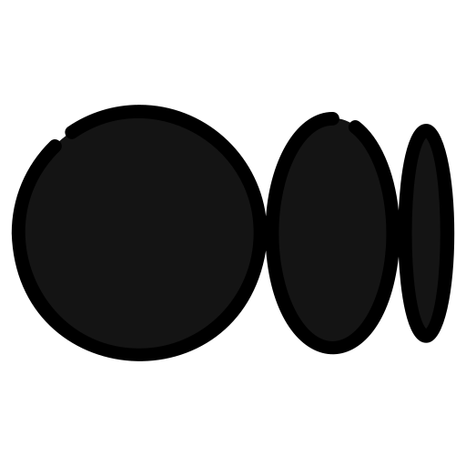

<p align="center">
  
</p>
<hr>

<p align="center">
<a href="https://www.linkedin.com/in/gagandeep-kaur-a56167197" style="text-decoration: none;">
  
</a>
&nbsp;&nbsp;&nbsp;&nbsp; <!-- Adds four non-breaking spaces for spacing -->
<a href="mailto:gagankaur1709@gmail.com" style="text-decoration: none;">
  
</a>
&nbsp;&nbsp;&nbsp;&nbsp;
<a href="https://medium.com/the-sixt-india-blog/introduction-to-test-containers-the-beginners-guide-dd1760f918a2" style="text-decoration: none;">
  
</a>
&nbsp;&nbsp;&nbsp;&nbsp;
<a href="https://devpost.com/gagankaur1709" style="text-decoration: none;">
  
</a>
&nbsp;&nbsp;&nbsp;&nbsp;
<a href="https://leetcode.com/u/gaganKaur/" style="text-decoration: none;">
  
</a>
</p>
<hr>

### 🚀 Welcome to My Digital Sanctum!
Konnichiwa! I am Gagandeep Kaur, a denizen of the digital frontier, where the future of technology is forged. My passion lies at the intersection of Artificial Intelligence and Software Engineering, crafting intelligent systems that transcend the boundaries of imagination.

--- 

### 🧠 My Digital Footprint

```json
{
  "name": "Gagandeep Kaur",
  "located_in": "Birmingham, UK",
  "current_position": "Postgraduate Student, MSc Advanced Computer Science",
  "university": "University of Birmingham",
  "previous_roles": [
    "Software Development Engineer at Sixt R&D",
    "Software Development Engineer Intern at Sixt R&D",
    "Event Coordinator & Student Representative"
  ],
  "ai_ml_experience": [
    "Machine Learning Fundamentals",
    "Natural Language Processing",
    "Classification & Recommendation Systems",
    "ML Model Evaluation",
    "Prompt Engineering & Test Case Generation"
  ],
  "concepts": [
    "Distributed Systems", "System Design", "Microservices",
    "CI/CD", "Event-driven Architecture", "OOP", "Concurrency", 
    "Integration Testing", "Advanced Networking", "AI for SE",
    "Human Computer Interaction", "Designing Secure systems"
  ],
  "current_learning": [
    "Advanced ML Algorithms", "Cloud-Native Applications", "Prompt-driven Software Testing"
  ],
  "career_interests": [
    "Backend Engineering", "AI-Powered Applications", "System Architecture",
    "Tech for Social Good", "Personalization & Recommendation Systems"
  ],
  "soft_skills": [
    "Cross-functional Collaboration",
    "Public Speaking",
    "Communication with Diverse Audiences"
  ],
  "notable_projects": [
    "Matching Algorithm for Study Buddy App (Hackathon Winner)",
    "Fault Tolerant Java RMI System (Literature Review)",
    "Bug Classification with ML (Academic Project)"
  ],
  "fun_facts": [
    "Spotify Power User",
    "Enjoys working on real-world problems using technology",
    "Loves to cook and experiment in the kitchen",
    "Dancer at heart – it’s her favourite stress-buster",
    "Regular at the gym – fitness keeps her focused",
    "Loves to code and build things that make life easier"
  ]
}

```

### Some Tools I Have Used and Learned
<p align="left">


       


</p>
